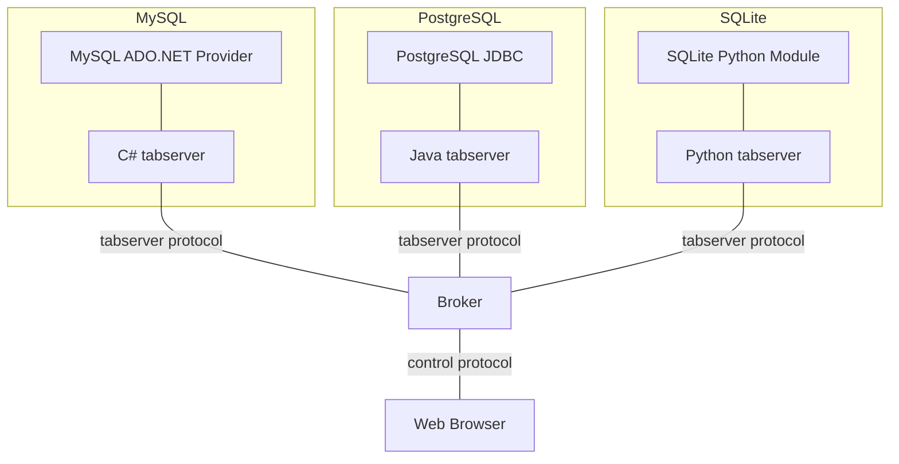
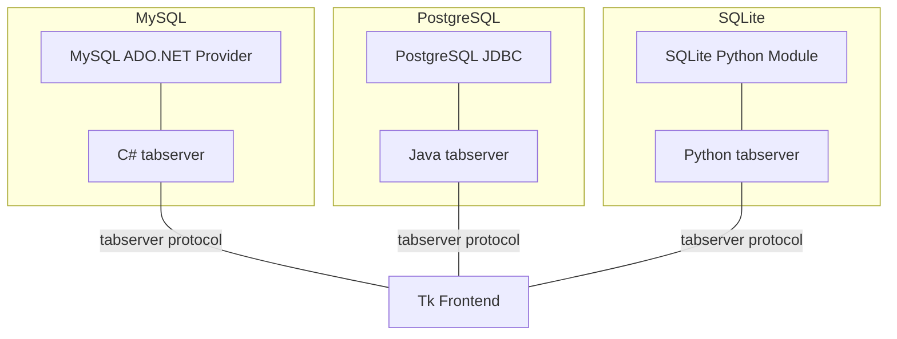
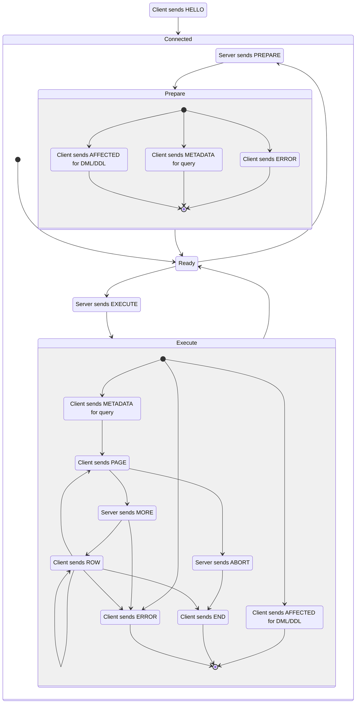

# tabserver Protocol

## Overview

tabserver is a minimalist protocol for communicating with databases. It is meant
to serve as a "SQL REPL" for *driver developers* and has the following
principles:

- It is **platform-independent** - unlike JDBC and ADO.NET etc. tabserver is not
  tied to a particular runtime environment or driver API. You get a consistent
  protocol and interface regardless of what platform the driver is built on.
  
- It is **compact** - a tabserver client can be implemented in a few hundred lines
  of code. A tabserver client is meat to be something small you can carry around
  and drop into any driver codebase for testing purposes.
  
- It is **self-contained** - tabserver isn't concerned with the details of making
  the connection to the database. These settings change frequently during
  debugging and are best handled by your testing code.
  
tabserver is *not* a replacement for traditional database management tools.
tabserver sacrifices integration and support for more complex database
interactions to achieve simple client implementations.

## Topology

tabserver is made up of the following components:

- The *client* bridges the database driver with the tabserver protocol. It
  accepts commands to execute queries and returns the rows reported by the
  database. 
  
- The *server* accepts queries from the user and presents results. It also
  multiplexes between connections so that multiple clients can be active at
  once.

- An optional *broker* that acts like a server, but forwards messages between
  the clients and an upstream server that hosts the actual UI. This is useful
  for environments that can't listen for connections on their own (Javascript).
  
For example, someone using the browser interface to manage a Postgres and a
MySQL connection would interact with a topology like this:
  


While someone using the Tk or some other native frontend will have this
topology:



## tabserver protocol

The tabserver protocol is a line-based query-response protocol. A simple session
looks like this:

```
client> HELLO
client> SQLite In-Memory Database

server> EXECUTE
server> SU5TRVJUIElOVE8gc3F1YXJlcyBWQUxVRVMgKDEsIDEpLCAoMiwgNCksICgzLCA5KQ==
comment: INSERT INTO squares VALUES (1, 1), (2, 4), (3, 9)

client> AFFECTED
client> 3

server> EXECUTE
server> U0VMRUNUICogRlJPTSBzcXVhcmVz
comment: SELECT * FROM squares

client> METADATA
client> 2
client> bg==
client> SU5URUdFUg==
comment: n and INTEGER
client> c3F1YXJl
client> SU5URUdFUg==
comment: square and INTEGER
client> PAGE

server> MORE
server> 2

client> ROW
client> MQ==
client> MQ==
comment: 1 and 1
client> Mg==
client> NA==
comment: 2 and 4
client> PAGE

server> MORE
server> 2

client> Mw==
client> OQ==
comment: 3 and 9
client> END
```

### Encoding

The tabserver protocol uses plain-text commands but base64 encodes dynamic
values provided by the user (query strings) or by the database (metadata and
data). This allows sending data with embedded newlines without worrying about
escaping issues. 

However, just because this data is encoded as base64 does not mean that it can
be arbitrary binary data. All command names, protocol messages (`HELLO`) and
numeric values must be UTF-8 encoded. And all data that is base64 encoded must
be UTF-8 when decoded.

In addition to text and base64, the tabserver protocol will sometimes send
integer values. These are rendered as base 10.

There is no insignificant whitespace, extra whitespace around a command renders
it invalid and blank lines are also invalid. Each line ends with a single `\n`. 

### Data Types

The tabserver protocol does not mandate any particular representation for values
in row data. Unlike the native database layers, tabserver does not have any
notions of types. All `ROW` data is treated as strings and it is up to the
client to convert values into useful string representations.

The same goes for NULL values. The client should not report these as blank to
avoid confusion with blank strings. A placeholder like `<null>` should be used
for this purpose.

### Error Handling

The tabserver protocol includes an `ERROR` reply, but it should only ever be
issued by the client for database errors. If any message is ever malformed or a
particular type of message is received when it is not allowed, the receiving end
immediately terminates the connection.

While it is harder to debug errors without it, a message for protocol-level
errors would require an extra mechanism to sync the state between the server and
the client. 

For example, consider two connections. The first sends a successful `HELLO` with
the (useless but valid) identifier `HELLO`:

```
client> HELLO
client> HELLO
```

Note that the server doesn't send an acknowledgment of the `HELLO`. The client
sends this command atomically, without waiting for the server. If another client
came along and did this:

```
client> HELO
client> HELLO
```

The server would send an `ERROR` for the `HELO` then accept the `HELLO` and
continue waiting for input. However, the client would only receive the error
after sending both lines. At that point the client doesn't know what the server
is complaining about - did it not like the `HELO` or the `HELLO`?

### Overview



### Commands

#### HELLO

```
HELLO
<text: Client identifier>
```

The client must send a `HELLO` command immediately after opening the connection
to the server. After the hello is a "client identifier" sent in plain-text. The
server uses this value to distinguish different database connections in its UI,
so the value here should be descriptive and ideally include both the type of
database and other identifying information (server name, default database, etc).

#### EXECUTE

```
EXECUTE
<base64: Query>
```

The server sends an `EXECUTE` command to run a query against the database. The
query itself is encoded on base64. The client may report an `ERROR` here,
`METADATA` (if the query produced a resultset) or `AFFECTED` (if it did not).

#### PREPARE

```
PREPARE
<base64: Query>
```

Like `EXECUTE` but the client does not run the query against the database, it
only asks the database to validate it and report the schema of its result. May
return any of the same messages that an `EXECUTE` would return.

#### MORE

```
MORE
<int: Page Size>
```

The server may send this after a client's `PAGE` response. It tells the client
to continue reading the current resultset and says how many rows it can return
before sending another `PAGE` or a `END`. The page size must be a positive
integer.

Note: while `MORE` should usually be an action that the user requests
explicitly, to avoid getting back more data than expected, the first `PAGE`
should receive an automatic `MORE` response. Once the first page has been
displayed the user can be prompted for more.

#### ABORT

```
ABORT
```

The server may send this after a client's `PAGE` response. It tells the client
to stop reading the current resultset. The client should close the resultset at
this point to avoid holding onto database resources.

### Replies

#### ERROR

```
ERROR
<base64: Message>
```

The client can respond to most commands (excluding `ABORT`) with an error. This
indicates an error from the database, either when preparing or executing a
command, or when reading the results of a query.

The message can contain any text and a server UI should give the error as much
room as possible to display (possibly scrolling it). tabserver is a debugging
aid and extended error messages like stack traces are often useful in that
context.

#### METADATA

```
METADATA
<int: Number of Columns>
<base64: Column Name> } one pair for each column
<base64: Column Type> }
```

The client may respond to a `PREPARE` or an `EXECUTE` with a `METADATA`,
indicating that the database recognized the query as a `SELECT` or some other
query type that produces output rows. The number of columns is reported on the
first line followed by a column name and type for each column.

#### AFFECTED

```
AFFECTED
<int: Rows Affected>
```

The client may respond to a `PREPARE` or an `EXECUTE` with an `AFFECTED`,
indicating that the query is DDL, DML or some other type that does not produce
output rows. The number of rows affected is reported on the first line.

#### PAGE

```
PAGE
```

Once a client has received an `EXECUTE` and sent the query's `METADATA`, it
sends a `PAGE` to indicate that result data is available. The server's response
(either a `MORE` or an `ABORT`).

Note that a `PAGE` *must* be able to return at least one row. If the client has
exhausted the resultset, it must reply with an `END`.

#### ROW

```
ROW
<base64: Column 1 data> }
<base64: Column 2 data> } one for each column reported by METADATA
...                     }
```

After a server has responded with a `MORE` the client can send row data. Each
row is part of a `ROW` command, which has one line of output per column reported
in the `METADATA`.

#### END

```
END
```

An `END` indicates that there is no more row data available and the client's
resultset has been closed.
